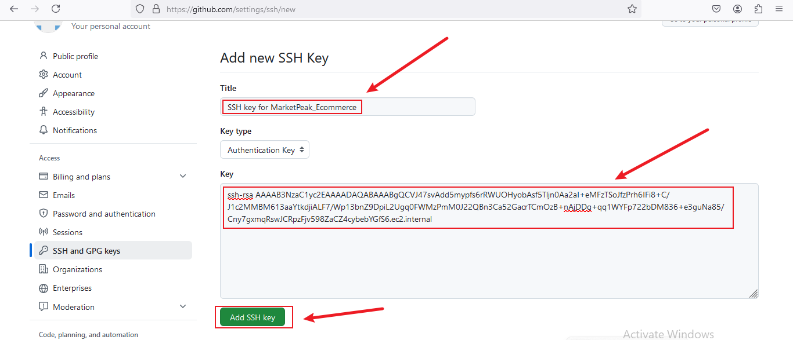

# Capstone Project: Introduction to Cloud Computing

## Capstone Project: E-Commerce Platform Deployment with Git, Linux, and AWS

### Project Instructions:
I have been assigned to develop an e-commerce website named **MarketPeak** for a new online marketplace. This platform will include essential features such as product listings, a shopping cart, and user authentication. To streamline development, I will be obtaining and preparing a pre-designed website template that meets the project requirements, rather than building the site from scratch.

The main objectives are to manage version control with Git, set up and configure the platform in a Linux environment, and deploy it on an AWS EC2 instance for scalability. This project will showcase my skills in using Git, Linux, and AWS to create a functional e-commerce platform.

### Step 1: Development on Local Workstation

#### Task 1: Implement Version Control with Git

##### 1.1 Initialize Git Repository

To begin, create the project directory named **MarketPeak_Ecommerce**, navigate into it, and initialize it as a Git repository.

**Note:** For this project, I am using **Git Bash** on a Windows workstation to execute these shell commands, as it provides a Unix-like command-line experience.

**Commands:**
```bash
mkdir MarketPeak_Ecommerce
cd MarketPeak_Ecommerce
git init
```


##### Task 1.2 Obtain and Prepare the E-Commerce Website Template

Instead of building the website from scratch, I’ll use a pre-existing e-commerce template. This approach allows me to focus on deployment and operational aspects rather than on web development, which is typically handled by web/software developers.

- **Download a Website Template**: Visit [Tooplate](https://www.tooplate.com/) or another free template resource to find a suitable e-commerce template. Choose one that is ready-to-use and requires minimal customization.

- **Recommended Template**: It’s suggested to use the specific template provided or one that meets the project’s requirements.


- **Prepare the Template**: Extract the downloaded template into the project directory, `MarketPeak_Ecommerce`.


##### 1.3 Stage and Commit the Template to Git

In this step, I will add the website files to the Git repository, configure my global Git settings, and make an initial commit with a descriptive message.

- **Add Files**: Add all website files to the staging area.

- **Configure Git User Information**: Set up global configuration with my actual git username and email address.

- **Commit Changes**: Commit the changes with a clear and descriptive message.

**Commands:**
```bash
git add .
git config --global user.name "YourUsername"
git config --global user.email "youremail@example.com"
git commit -m "Initial commit with basic e-commerce site structure"
```


##### Task 1.4 Push the code to your Github repository

After initializing your Git repository and adding your e-commerce website template, the next step is to push your code to a remote repository on GitHub. This step is crucial for version control and collaboration.

- Create a Remote Repository on GitHub: Log into your GitHub account and create a new repository named MarketPeak_Ecommerce. Leave the repository empty without initializing it with a README, .gitignore, or license.
  
  
  

- Link Your Local Repository to GitHub: In your terminal, within your project directory, add the remote repository URL to your local repository configuration.

- Push Your Code: Upload Your Local Repository Content to GitHub
Once you have linked your local repository to GitHub, use the following command to push your commits from your local main branch to the remote repository. This enables you to store your project in the cloud and share it with others.

**Commands:**
```bash
git remote add origin https://github.com/Holuphilix/MarketPeak_Ecommerce.git
git branch -M main
git push -u origin main
```


### Step 2: AWS Deployment

To deploy the MarketPeak_Ecommerce platform, you'll start by setting up an Amazon EC2 instance.

##### Task 2.1: Setup an AWS EC2 instance for deployment

- Log in to the AWS Management Console.


- Launch an EC2 instance using an Amazon Linux AMI.


- Showing an EC2 instance running 


- Make sure you're logged into your EC2 instance using SSH. You should see a command prompt indicating you are on your instance, typically something like:


##### Task 2.2: Clone the repository on the Linux Server

Before deploying your e-commerce platform, you need to clone the GitHub repository to your AWS EC2 instance. This process involves authenticating with GitHub and choosing between two primary methods of cloning a repository: SSH and HTTPS.

- Navigate to your repository in github console

- Select the __'code'__ as highlited in the image below


##### SSH Method:

- On your EC2 instance, generate SSH keypair using ssh-keygen as shown

**Command:**
```bash
ssh-keygen
```


- Cat and Copy the public key.

**Command:**
```bash
cat /home/ec2-user/.ssh/id_rsa.pub
```


- Adding ssh public key to GitHub repository by click on your image icon, click on settings, then click on click on ssh and Gkeys





After adding the SSH key to your GitHub account, you should be able to use it for secure access to your GitHub repositories from your EC2 instance or any system where the private key is stored.

- Use the SSH clone URL to clone the repository

**Command:**
```bash
git clone git@github.com:Holuphilix/MarketPeak_Ecommerce.git
```


##### HTTPS Method:

For repositories that you plan to clone without setting up SSH keys, use the HTTPS URL. GitHub will prompt for your username and password:

__Note__: that github.com no longer accept password, but you will have to generate tokens

**Command:**
```bash
git clone https://github.com/Holuphilix/MarketPeak_Ecommerce.git
```


##### Task 2.3 Install a Web Server on EC2

Apache HTTP Server (httpd) is a widely used web server that serves HTML files and content over the internet. Installing it on Linux EC2 server allows you to host MarketPeak E-commerce site

- Install Apache web server on the EC2 instance: Note that httpd is the software name for Apache on redhats systems using yum package manager

**Commands:**
```bash
sudo yum update -y
sudo yum install httpd -y
sudo systemctl start httpd
sudo systemctl enable httpd
```


##### Task 2.4 Configure httpd for Website

- Prepare the Web Directory: Clear the default httpd web directory and copy MarketPeak Ecommerce website files to it.

- Reload httpd: Apply the changes by reloading the httpd service.

**Commands:**
```bash
sudo rm -rf /var/www/html/*
sudo cp -r ~/MarketPeak_Ecommerce/* /var/www/html/
sudo systemctl reload httpd
```


##### Task 2.4 Access Website from Browser

Access Website from Browser With httpd configured and website files in place, MarketPeak Ecommerce platform is now live on the internet: Open a web browser and access the public IP (http://52.91.229.211/2129_crispy_kitchen/) of your EC2 instance to view the deployed website.


### Step 3: Continuous Integration and Deployment Workflow

To ensure a smooth workflow for developing, testing, and deploying my e-commerce platform, follow this structured approach. It covers making changes in a development environment, utilizing version control with Git, and deploying updates to your production server on AWS.

##### Task 3.1: Developing New Features and Fixes

 - Create a Development Branch: Begin your development work by creating a separate branch. This isolates new features and bug fixes from the stable version of your website. 
**Commands:**
```bash
git branch development
git checkout development
```


- Implement Changes: On the development branch, add your new features or bug fixes. This might include updating web pages, in my case, I just changed the slide image.

##### Task 3.2: Version control with Git

- Stage Your Changes: Once you've made the changes, stage the files you modified. You can add them individually, or if you've only changed the slide image, you can stage everything with.

- Commit Your Changes: After staging, commit your changes with a clear message describing the update.

- Push Changes to Remote Development Branch: Push your changes to the remote development branch to keep everything updated.

**Commands:**
```bash
git add .
git commit -m "Add new features or fix bugs"
git push origin development
```


##### Task 3.3: Pull Requests and Merging to the Main branch

- Create a Pull Request (PR): On GitHub, create a pull request to merge the development branch into the main branch. This process is crucial for code review and maintaining code quality.


- Switch to the Main Branch: First, make sure you’re on the main branch by running and Merge Development into Main: Merge the changes from the development branch into the main branch.

**Commands:**
```bash
git checkout main
git merge development
```


- Push the Main Branch to GitHub: Once the merge is complete, push the main branch to GitHub to update the remote repository with the changes


##### Task 4: Deploying Updates to the Production Server

- Pull the Latest Changes on the Server: SSH into your AWS EC2 instance where the production website is hosted. Navigate to the website's directory and pull the latest changes from the main branch.

**Command:**
```bash
git pull origin main
```


- Restart the Web Server (if necessary): Depending on the nature of the updates, you may need to restart the web server to apply the changes.

**Commands:**
```bash
sudo rm -rf /var/www/html/*
sudo cp -r ~/MarketPeak_Ecommerce/2129_crispy_kitchen/* /var/www/html/
sudo systemctl reload httpd
```


##### Task 5: Testing the New Changes

- Access the Website: Open a web browser and navigate to the public IP address of your EC2 instance. Test the new features or fixes to ensure they work as expected in the live environment.

- This workflow emphasizes best practices in software development and deployment, including branch management, code review through pull requests, and continuous integration/deployment strategies. By following these steps, you maintain a stable and up-to-date production environment for your e-commerce platform. http://54.147.242.242/


